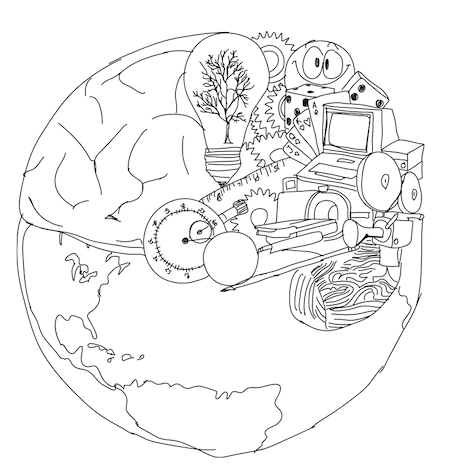

```{=html}
<style type="text/css">
.title {
  display: none;
}

#getting-started img {
  margin-right: 10px;
}
</style>
```
<div class="row" style="padding-top: 30px;">

::: col-sm-6
# **Big Data in International Relations**

This is the assignment reports for the Big Data in International Relations course, by **group 4**.

-   Task 1: We performed a word count and created a word cloud visualization using resources from the [Tidy Text Mining](https://www.tidytextmining.com/) website. Additionally, we conducted bigram and sentiment analysis as part of this task.

-   Task 2: This task is divided into two parts. First, we performed sentiment analysis using the provided tweet.csv dataset. Second, we gathered and analyzed journal articles focusing on sentiment analysis related to the topic of Hillary Clinton vs. Donald Trump, using data exclusively from these journals.

-   Task 3: Our objective was to generate a word cloud visualization based on the public lecture delivered by the Secretary General of the National Energy Council on May 29, 2024, at FISIP UPNVJ.
:::

::: col-sm-6

:::
